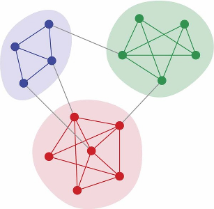

# Tutorial on Community Structures

### GRAPHADON Summer School


---


## Outline

<Toc maxDepth=1 />


---
layout: two-cols

---

##  Community Structure


**Intuitively**, communities are groups of nodes where:

- More links between nodes from the same community,
- Fewer links between nodes from different communities.

<!-- image out of positionning flow, positioned relative to bottom right og page. Une UnoCSS Classes -->
<!--  -->

::right ::
<!-- centered image vertical and horizontal -->
<div class="flex items-center justify-center">
  
</div>
<!--  -->


---

##  Community structure

Lots of complex networks exhibit community structure.

- Social networks,
- Biological networks,
- Information networks,
- Road networks,
- ...

<!-- 4 images side by side, with space -->
<div class="flex justify-between">
  
  
  
  
</div>
<!--  -->


---

##  Determining Community Structure


Most often we use two kinds of criteria:

- **Internal validity**: some sort of measure indicates the importance of links inside communities compared to links between communities
- **External validity**: we rely on an expert, having a knowledge on the network semantics, to validate the communities

---

##  Agenda

- Try to detect communities inside a network using various tools
- Try to measure the quality of the community structure
- Try to adapt to the network dynamics.


---

##  Determining Communities


- **Optimizing the minimum cut**: The number of communities is known in advance. One search to minimize the number of edges between communities (the cut)
- **Hierarchical clustering**: Uses a similarity measure to group node pairs, in communities, then to group communities
- **Girvan-Newman algorithm**: Progressively remove edges that lie between communities, using some measures to identify them
- **Modularity maximization**: Various techniques (often metaheuristics) to compute network divisions and maximize **modularity**

---

##  Modularity

One of the most used measure is the modularity $Q$.

Intuition:  $Q$ measures the fraction of intra-communities edges minus the same fraction if the network had edges at random (with the same communities divisions). [M. E. J. Newman (2006)](http://www.pnas.org/content/103/23/8577.full)

- If $Q=0$ the edges intra-communities is not better than random.
- If  $Q=1$ we have very strong community structure.
- In practice modular network lie between $Q=0.3$ and $Q=0.7$.

Modularity gives results in $\left[-\frac{1}{2} .. 1\right]$.

---

##  Modularity


- Internal links $I_c$ in each community $c$ 
- Outside links $O_c$ go out of the community $c$
- Total number of links $m$ in the network


---

##  Modularity


Compare the ratio $\frac{I_c}{m}$ with the expected value in the same network but with all its links randomly rewired (configuration model)

$\left( \frac{2I_c + O_c}{2m} \right)^2~~~~~~~~$ 


$$
Q = \sum_c\frac{I_c}{m} - \sum_c\left( \frac{2I_c + O_c}{2m} \right)^2
$$

---

##  Network dynamics?

Computing the **modularity** can take some time but computing the **communities** themselves is the most demanding task

- Can we recompute the communities every time the network changes?
- Can we reuse the previous communities to speed up the process?

---

##  Graph layouts

A ~~novel~~  approach to determine modules uses graph layouts.

- A layout is a mapping of nodes in a space,
- positions are given according to a (aesthetic) criteria.

Most layout algorithms are **force based**:

- repulsive force among all nodes,
- attractive force between connected nodes.

<!-- 2 images side by side -->
<div class="flex justify-between">
  
  
</div>


---

##  The Lin-Log layout


- No aesthetic Layout
- Densely connected nodes are grouped at nearby positions.
- Weakly connected nodes are separated at distant positions.

Most force based algorithms try to the minimize energy.

Lin-Log is based on a $(a,r)$-energy model.

- $a$ is the attraction force factor,
- $r$ the repulsion force factor.


---

##  The Lin-Log layout and network dynamics


After a change in the network the algorithm  computes the layout from its **previous equilibrium state**.

Chances are that reusing previous state costs less than a complete re-computation  (c.f. re-optimization).

The **Lin-Log** layout was proposed by [Andreas Noack (2007)](http://emis.u-strasbg.fr/journals/JGAA/accepted/2007/Noack2007.11.2.pdf).


---

##  Practical session


We will see how to:

1. Read, layout and display a graph automatically.
2. Control the layout directly and change it to a Lin-Log layout.
3. Retrieve feedback from the distant view process.
4. Compute communities from the Lin-Log layout and display them.
5. Retrieve the communities.
6. Compute the modularity of these communities.
7. Stress the method on a highly dynamic network.


---

##  How GraphStream handles display


GraphStream puts the display of the graph in a separate **thread** or **process** or **host**.

Usually the display will evolve in **parallel** of the main application  running on the graph.


---

##  How GraphStream handles graph layouts


By default the viewer creates another thread to handle the layout.
The default Layout algorithm is a derivative of the Frutcherman-Reingold one.


---

## Our Pipeline


---

### Step 1
Open the `modularity` package (`src/org/graphstream/demo/modularity`), then the `LinLogLayout.java` file.

```java
public class LinLogLayout {
  // ...
  private Graph graph;
  private Viewer viewer;
  public void findCommunities(String fileName)
      throws IOException, GraphParseException {
    graph = new SingleGraph("communities");
    viewer = graph.display(true);
    graph.read(fileName);
  }
}
```

It creates a graph, displays, launches an automatic layout on it (the `display(true)` argument) and then reads it.


---

##  Before proceeding


Before proceeding, to avoid compilation problems copy and paste the following imports to your program, just under the already present imports:

```java
import org.graphstream.algorithm.ConnectedComponents;
import org.graphstream.algorithm.measure.Modularity;
import org.graphstream.graph.Edge;
import org.graphstream.stream.ProxyPipe;
import org.graphstream.ui.graphicGraph.GraphPosLengthUtils;
import org.graphstream.ui.graphicGraph.stylesheet.StyleConstants.Units;
import org.graphstream.ui.layout.springbox.implementations.LinLog;
import org.graphstream.ui.spriteManager.Sprite;
import org.graphstream.ui.spriteManager.SpriteManager;
```


---

###  Step 2


1. Stop the automatic layout.
2. Create our own LinLog layout.
3. Configure it using some $a$ and $r$ parameters.
4. Connect the layout graph events output to the graph so that the graph nodes receive position attributes.
5. Connect the graph to the layout so that the layout receive each modification event on the graph.
6. Run the layout in a loop.

----

### Step 2

```java {1-4,7-12,14-16}
private LinLog layout;                  // 2
private double a = 0;                   // 3
private double r = -1.3;                // 3
private double force = 3;               // 3
public void findCommunities(String fileName) throws ... {
  graph = new SingleGraph("communities");
  viewer = graph.display(false);        // 1
  layout = new LinLog(false);           // 2
  layout.configure(a, r, true, force);  // 3
  layout.addSink(graph);                // 4
  graph.addSink(layout);                // 5
  graph.read(fileName);

  while(true) {                         // 6
    layout.compute();                   // 6
  }                                     // 6
}
```

Let's run it and observe the difference with the former layout.


---

###  Step 3


Problem: The viewer runs in its own thread any interaction with it is not reflected on the graph. Try to grab a node with the mouse and move it... See?

Let's fix this:

1.  Create a back link from the viewer the main process.
2.  Connect this link to our graph in order to receive events.
3.  Proactively check for new events from the viewer.
4.  Check if the user closed the viewer window to properly end the program.

----


----

### Step 3

```java {1,5,10,,12,13}
private ProxyPipe fromViewer;                          // 1
public void findCommunities(String fileName) throws ... {
  graph = new SingleGraph("communities");
  viewer = graph.display(false);
  fromViewer = viewer.newThreadProxyOnGraphicGraph();  // 1
  layout = new LinLog(false);
  layout.configure(a, r, true, force);
  layout.addSink(graph);
  graph.addSink(layout);
  fromViewer.addSink(graph);                           // 2
  graph.read(fileName);
  while(! graph.hasAttribute("ui.viewClosed")) {       // 4
    fromViewer.pump();                                 // 3
    layout.compute();
  }
}

```

Now try to grab a node in the display.

----

## Finding community structure with a Lin-Log layout
**Lin-Log** creates long edges outside communities and short edges between nodes in the same communities.

Let's use this property to obtain a quick (and hopefully good enough) approximation of the communities.

- Cut edges that are longer than the global average edge length.
- The cut can then be optimised  above or under this average to improve the communities.


---

###  Step 4


1. Add a stylesheet on the graph.
2. Prepare for detection of communities using the layout.
3. Specify a cut threshold (a factor for the average edge length).


---

###  Step 4

```java{1,4,9,12-14,15-18}
private double cutThreshold = 1;                    // 4
public void findCommunities(String fileName) throws ... {
  // ...
  graph.setAttribute("ui.stylesheet", styleSheet);  // 1
  graph.read(fileName);
  while(! graph.hasAttribute("ui.viewClosed")) {
    fromViewer.pump();
    layout.compute();
    showCommunities();                               // 3
  }
}
public void showCommunities() {                      // 3
  // ...
}
protected static String styleSheet =                // 1
    "node { size: 7px; fill-color: rgb(150,150,150); }" +
    "edge { fill-color: rgb(255,50,50); size: 2px; }" +
    "edge.cut { fill-color: rgba(200,200,200,128); }";
```


---

###  Step 4 a

From the stylesheet:

- Edges are **red**.
- Edges with  `ui.class` set to `"cut"`   are **grey**.

First part of the `showCommunities()` method :

1. Browse each edge.
2. Store each edge's length.
3. Compute the average edge length.

---

### Step 4 a

```java {2-7}
public void showCommunities() {
  int nEdges = graph.getEdgeCount();
  double averageLength = graph.edges().map(edge -> { // 1
    double length = GraphPosLengthUtils.edgeLength(edge);
    edge.setAttribute("length", length); // 2
    return length;
  }).reduce(0.0, (a, b) -> a + b) / nEdges; // 3
  // ...
}
```

---

### Step 4 b

Second part of the `showCommunities()` method:  select which edge is inter-community.

1. Browse anew each edge.
2. Compare their length with the **average** length.
3.  
    a. If they are longer, mark them with a `"cut"` attribute.
    b. Else, remove the "cut" attribute.

---

### Step 4 b

```java {3-12}
public void showCommunities() {
  // ...
  graph.edges().forEach(edge ->{                  // 1
    double length = edge.getNumber("length");
    if(length > averageLength * cutThreshold) { // 2
      edge.setAttribute("ui.class", "cut");     // 3.1
      edge.setAttribute("cut");
    } else {
      edge.removeAttribute("ui.class");         // 3.2
      edge.removeAttribute("cut");
    }
  });
}
```


---

##  The Zachary Karate Club

The graph we use as a demo comes from a well known social study in a Karate Club.

Nodes represent members and edges their friendship ties.

At a given time one of the member left the club to create its own club. Some members stayed in the old one, while others quit to join the new one.

This graph usually admits at least two communities (the two clubs), although smaller sub-communities can be observed.


---

##  Computing the number of communities


GraphStream contains a algorithm that **compute** and **update** the number of **connected components** of a graph.

This algorithm can ignore  edges with a specific attribute (say `"cut"`).

**Sprites** in the viewer help visual the number of communities.


---

###  Step 5 a


Compute the number of connected components

1. Add a connected component algorithm.
2. Initialize it on the graph.
3. Setup a cut attribute so that the algorithm ignore the long edges.


---

###  Step 5 a

```java{2,8,11}
// ...
private ConnectedComponents cc;                           // 1
public void findCommunities(String fileName) throws ... {
  graph = new SingleGraph("communities");
  viewer = graph.display(false);
  fromViewer = viewer.newThreadProxyOnGraphicGraph();
  layout = new LinLog(false);
  cc = new ConnectedComponents(graph);                    // 2

  layout.configure(a, r, true, force);
  cc.setCutAttribute("cut");                              // 3
  // ...
}
// ...
```

---

### Step 5 b

Display the number of connected components using a sprite:

1. Create a sprite that will indicate the connected component count.
2. Position this sprite.
3. Update it regularly with the number of components.
4. Update the style sheet to display the sprite correctly.


---

```java{2-3,7-8,11,16,17}
// ...
private SpriteManager sm;                                  // 1
private Sprite ccCount;                                    // 1
public void findCommunities(String fileName) throws ... {
  // ...
  cc = new ConnectedComponents(graph);
  sm = new SpriteManager(graph);                           // 1
  ccCount = sm.addSprite("CC");                            // 1
  // ...
  cc.setCutAttribute("cut");
  ccCount.setPosition(Units.PX, 20, 20, 0);                // 2
  // ...
  while(! graph.hasAttribute("ui.viewClosed")) {
    //...
    showCommunities();
    ccCount.setAttribute("ui.label",                       // 3
      String.format("Modules %d", cc.getConnectedComponentsCount()));
  }
}
```

---

```java{4,5}
protected static String styleSheet =                     
    //...
    "edge.cut { fill-color: rgba(200,200,200,128); }" +
    "sprite {text-alignment: at-right;}"+
    "sprite#CC { size: 0px; text-color: rgb(150,100,100); text-size: 20; }";
```


---

###  Computing the modularity

Now that communities are identified, we can measure partition quality.

GraphStream has a **modularity** algorithm that updates with each graph change.

- The **modularity** algorithm needs each node to have a community attribute.
- The **connected components** algorithm can identify each component.

---

### Step 6 a

1. Add the modularity algorithm.
2. Create it so that it uses the  `"module"` attribute on nodes.
3. Initialise it on the graph.
4. Have the connected components algorithm tag components/communities with a `"module"` attribute.


---

###  Step 6 a

```java{2,6,8,12}
// ...
private Modularity modularity;                            // 1
public void findCommunities(String fileName) throws ... {
  // ...
  ccCount = sm.addSprite("CC");
  modularity = new Modularity("module");                  // 2

  modularity.init(graph);                                 // 3
  layout.configure(a, r, true, force);
  cc.setCutAttribute("cut");
  ccCount.setPosition(Units.PX, 20, 20, 0);
  cc.setCountAttribute("module");                         // 4
  // ...
}
```


---

###  Step 6 b


Display the modularity value using a sprite:

1. Add a sprite for the modularity.
2. Position it.
3. Update it regularly with the modularity value.
4. Update the style sheet for this other sprite.


---


```java {2,6,9,15-16}
// ...
private Sprite ccCount, modValue;                            // 1
public void findCommunities(String fileName) throws ... {
  // ...
  modularity = new Modularity("module");
  modValue = sm.addSprite("M");                              // 1
  // ...
  cc.setCountAttribute("module");
  modValue.setPosition(Units.PX, 20, 40, 0);                 // 2
  // ...
  while(! graph.hasAttribute("ui.viewClosed")) {
    //...
    ccCount.setAttribute("ui.label",
      String.format("Modules %d", cc.getConnectedComponentsCount()));
    modValue.setAttribute("ui.label",                        // 3
      String.format("Modularity %f", modularity.getMeasure()));
  }
}
```

---

```java{3,4}
protected static String styleSheet =
    // ...                                                   
    "sprite#CC { size: 0px; text-color: rgb(150,100,100); text-size: 20; }" +
    "sprite#M  { size: 0px; text-color: rgb(100,150,100); text-size: 20; }";
```


---

##  That's it!


Several additional graphs can be found in the `data` directory of the project.

Feel free to experiment with these graphs and adjust the `cutThreshold` parameter, as well as the $(a, r)$ and `force` parameters. Below are some recommended values for these graphs:

| Graph        | a | r    | force | cutThreshold |
|--------------|---|------|-------|--------------|
| karate.gml   | 0 | -1.3 | 3     | 1            |
| dolphins.gml | 0 | -1.2 | 8     | 0.8          |
| polbooks.gml | 0 | -1.9 | 5     | 0.8          |


---

## What about a dynamic graph?

Let's try the method on a really dynamic graph.

Consider a [Boids](http://www.red3d.com/cwr/boids/) Simulation.


The `LinLogLayoutAndBoids.java` file in the ` modularity` package contains a working example of LinLog analysis of a Boids simulation.

<!-- image at bottom center of page -->
<div class="absolute  flex justify-center z--1">
  
</div>